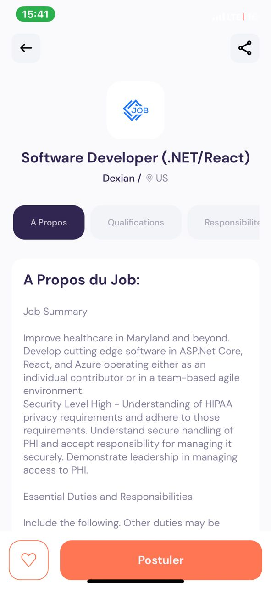
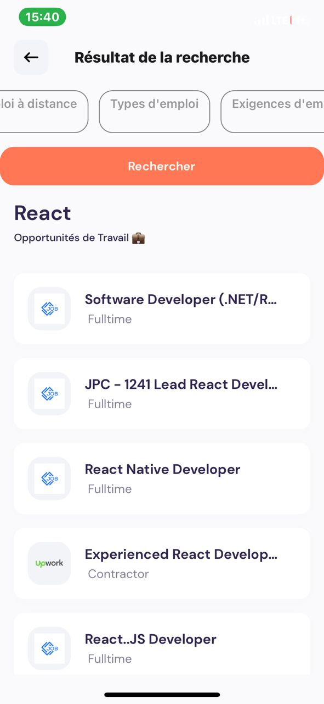

# React Native Jobs

This project is a React Native application dedicated to job searching. It allows users to search for job listings, view job details using the JSearch API from the RapidApi platform. It is continually evolving.

## Images

<div style="display: flex; justify-content: space-between;">
  
  
  
</div>


## Project Structure 

The project's directory structure is organized as follows:

- **.env**: Configuration file for environment variables.
- **.gitignore**: Configuration file to exclude certain files or directories from Git tracking.
- **.vscode**: Visual Studio Code-specific configuration.
- **app**: Main directory of the application.
  - **index.js**: Entry point of the application.
  - **job-details**: Contains components for displaying job details.
  - **search**: Contains components for job searching.
  - **_layout.js**: Common layout component.
- **app.json**: Application configuration.
- **assets**: Contains static resources such as images and fonts.
- **babel.config.js**: Babel configuration for JavaScript transpilation.
- **components**: Reusable components used throughout the application.
- **constants**: Global constants and configurations.
- **hooks**: Custom function APIs used in the application.
- **styles**: Style files for components.
- **utils**: Utility functions and helper utilities.

## How to Run the Project

To run this project on your local machine, follow these steps:

1. Clone the repository from GitHub:

   ```shell
   git clone https://github.com/your-username/react_native_jobs.git
   ```

2. Navigate to the project directory:

   ```shell
   cd react_native_jobs
   ```

3. Install dependencies:

   ```shell
   npx create-expo-app -e with-router
   npm install
   ```

4. Start the application:

   ```shell
   npx expo start
   ```

5. Follow the instructions for running the app on an emulator, physical device, or web browser through the Expo app.

## IMPORTANT
Please make sure to replace the API key with your own in the search functions that query the API. These are located in the "useFetch.js" and [id].js files.

## 📝 Notes

- [Expo Router: Docs](https://expo.github.io/router)
- [Expo Router: Repo](https://github.com/expo/router)

## Contributions

Contributions are welcome! If you would like to contribute to this project, please create a pull request with your changes.

## License

This project is licensed under the [MIT License](LICENSE).
